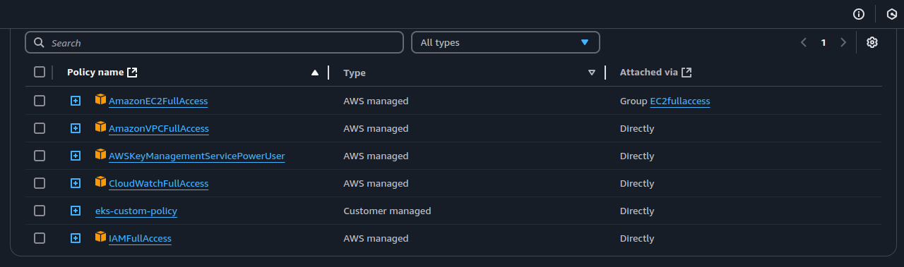
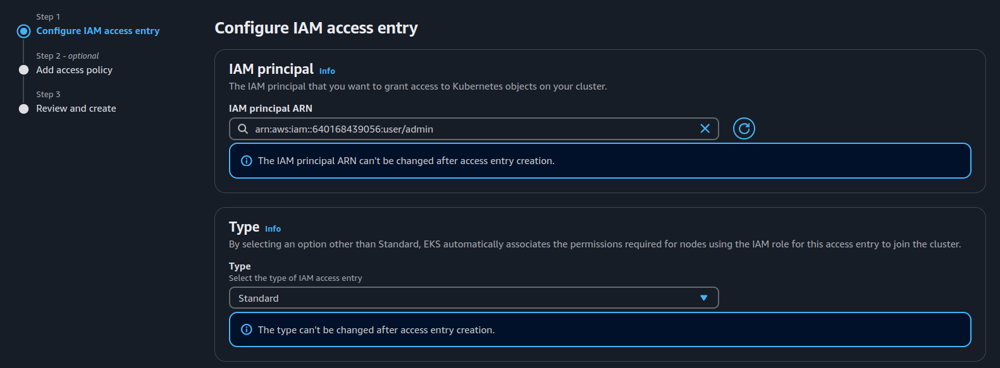
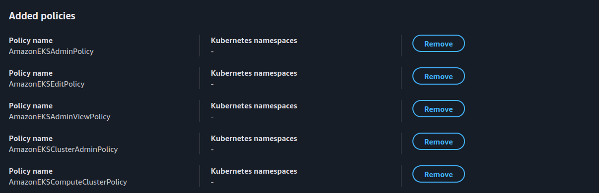

# Eks-Terraform-Setup

This repository contains a minimal setup to create an EKS cluster using Terraform.

## Prerequisites :

### Terraform :
    ```sh
    wget -O - https://apt.releases.hashicorp.com/gpg | sudo gpg --dearmor -o /usr/share/keyrings/hashicorp-archive-keyring.gpg
    echo "deb [arch=$(dpkg --print-architecture) signed-by=/usr/share/keyrings/hashicorp-archive-keyring.gpg] https://apt.releases.hashicorp.com $(lsb_release -cs) main" | sudo tee /etc/apt/sources.list.d/hashicorp.list
    sudo apt update && sudo apt install terraform
    ```
### AWS CLI :
    ```sh
    apt install unzip wget
    wget "https://awscli.amazonaws.com/awscli-exe-linux-x86_64.zip"
    unzip awscli-exe-linux-x86_64.zip
    sudo ./aws/install
    ```
### Kubectl :
    ```sh 
    K8S_VERSION=1.32
    apt-get update
    apt-get install --quiet --yes apt-transport-https ca-certificates curl
    curl -fsSL https://pkgs.k8s.io/core:/stable:/v${K8S_VERSION}/deb/Release.key | \
    gpg --dearmor -o /etc/apt/keyrings/kubernetes-apt-keyring.gpg
    echo "deb [signed-by=/etc/apt/keyrings/kubernetes-apt-keyring.gpg] https://pkgs.k8s.io/core:/stable:/v${K8S_VERSION}/deb/ /" | \
    tee /etc/apt/sources.list.d/kubernetes.list
    apt-get update
    apt-get install --quiet --yes kubectl
    ```

### IAM and EKS Policies :

* add an IAM user with the following policies attached :
    - AmazonEC2FullAccess
    - AmazonVPCFullAccess
    - IAMFullAccess
    - CloudWatchFullAccess
    - AWSKeyManagementServicePowerUser



* create a custom policy with the following permissions and attach it to the IAM user :
    ```sh
    {
        "Version": "2012-10-17",
        "Statement": [
            {
                "Effect": "Allow",
                "Action": [
                    "eks:CreateCluster",
                    "eks:DeleteCluster",
                    "eks:DescribeCluster",
                    "eks:UpdateClusterVersion",
                    "eks:UpdateClusterConfig",
                    "eks:UpdateNodegroupConfig",
                    "eks:CreateNodegroup",
                    "eks:DeleteNodegroup",
                    "eks:DescribeNodegroup",
                    "eks:ListNodegroups",
                    "eks:DescribeUpdate",
                    "eks:TagResource",
                    "eks:UntagResource",
                    "eks:ListTagsForResource",
                    "eks:AccessKubernetesApi",
                    "eks:ListClusters"
                ],
                "Resource": "*"
            }
        ]
    }
    ``` 

### AWS CLI Configuration :

* create an authentication token for the IAM user with the previously attached policies in the aws console
* configure the aws cli with the access key and secret key :

    ```sh
    aws configure
    ```
    - example configuration :
        ```sh
        AWS Access Key ID [None]: "access_key"
        AWS Secret Access Key [None]: "secret_key"
        Default region name [None]: "region"
        Default output format [None]: "json"
        ```
* credentials are stored in the `~/.aws/credentials`
* the configuration can be tested by running the following command :
    ```sh
    aws sts get-caller-identity
    ```

## Terrform Setup :

* the configuration is divided into 3 main files :

### provider.tf :

* import the AWS provider with version constraints and set the nearest region in my case its `eu-west-3` :
    ```hcl
    terraform {
    required_providers {
        aws = {
        source  = "hashicorp/aws"
        version = "~> 5.0"
        }
    }
    }
    provider "aws" {
    region = "eu-west-3"
    }
    ```
### network.tf :

* contains the network infrastructure configuration :
    - VPC : 
        ```hcl
        resource "aws_vpc" "vpc" {
            cidr_block = "10.0.0.0/16"
            enable_dns_hostnames = true
            tags = {
                Name = "eks-vpc"
            }
        }
        ```
    - Public and Private Subnets : multiple subnets are created in different availability zones to ensure high availability
        ```hcl
        resource "aws_subnet" "subnet_1" {
            vpc_id                  = aws_vpc.vpc.id
            cidr_block              = "10.0.1.0/24"
            availability_zone       = "eu-west-3a"
            map_public_ip_on_launch = true
            tags = {
                Name = "public-subnet-1"
            }
        }
        resource "aws_subnet" "subnet_2" {
            vpc_id                  = aws_vpc.vpc.id
            cidr_block              = "10.0.2.0/24"
            availability_zone       = "eu-west-3a"
            map_public_ip_on_launch = true
            tags = {
                Name = "public-subnet-2"
            }
        }
        resource "aws_subnet" "subnet_3" {
            vpc_id                  = aws_vpc.vpc.id
            cidr_block              = "10.0.3.0/24"
            availability_zone       = "eu-west-3b"
            map_public_ip_on_launch = false
            tags = {
                Name = "private-subnet-1"
            }
        }
        resource "aws_subnet" "subnet_4" {
            vpc_id                  = aws_vpc.vpc.id
            cidr_block              = "10.0.4.0/24"
            availability_zone       = "eu-west-3b"
            map_public_ip_on_launch = false
            tags = {
                Name = "private-subnet-2"
            }
        }
        ```
    - Internet Gateway : route the traffic to the internet
        ```hcl
        resource "aws_internet_gateway" "internet_gw" {
        vpc_id = aws_vpc.vpc.id
        }
        ```
    - Route Tables : route the traffic to the internet gateway and the local network
        ```hcl
        resource "aws_route_table" "public-rt" {
            vpc_id = aws_vpc.vpc.id
            route {
                cidr_block = "0.0.0.0/0"
                gateway_id = aws_internet_gateway.internet_gw.id
            }
            route {
                cidr_block = "10.0.0.0/16"
                gateway_id = "local"
            }
        }

        resource "aws_route_table" "private-rt" {
            vpc_id = aws_vpc.vpc.id
            route {
                cidr_block = "10.0.0.0/16"
                gateway_id = "local"
            }
        }
        ```
        - Route Table Associations : associate the subnets with the route tables 
        ```hcl
        resource "aws_route_table_association" "subnet_1_association" {
            subnet_id      = aws_subnet.subnet_1.id
            route_table_id = aws_route_table.public-rt.id
        }
        resource "aws_route_table_association" "subnet_2_association" {
            subnet_id      = aws_subnet.subnet_2.id
            route_table_id = aws_route_table.public-rt.id
        }

        resource "aws_route_table_association" "subnet_3_association" {
            subnet_id      = aws_subnet.subnet_3.id
            route_table_id = aws_route_table.private-rt.id
        }
        resource "aws_route_table_association" "subnet_4_association" {
            subnet_id      = aws_subnet.subnet_4.id
            route_table_id = aws_route_table.private-rt.id
        }

        ```
### eks.tf : 

* this configuration uses the `eks` module to setup an eks cluster :
    ```hcl
    module "eks" {
        source  = "terraform-aws-modules/eks/aws"
        version = "~> 20.0"

        cluster_name    = "eks-cluster"
        cluster_version = "1.31"

        cluster_endpoint_public_access = true

        vpc_id                   = aws_vpc.vpc.id
        subnet_ids               = [aws_subnet.subnet_1.id, aws_subnet.subnet_2.id, aws_subnet.subnet_3.id,aws_subnet.subnet_4.id]
        control_plane_subnet_ids = [aws_subnet.subnet_1.id, aws_subnet.subnet_2.id, aws_subnet.subnet_3.id,aws_subnet.subnet_4.id]

        eks_managed_node_groups = {
            green = {
            min_size       = 1
            max_size       = 1
            desired_size   = 1
            instance_types = ["t3.medium"]
            }
        }
    }
    ```
## Running the configuration :

* initialize the terraform configuration :
    ```sh
    terraform init
    ```
* plan the configuration :
    ```sh
    terraform plan
    ```
* apply the configuration :
    ```sh
    terraform apply
    ```
## Connecting to the EKS Cluster :

* run the following command to update the kubeconfig file located in `~/.kube/config` :
    ```sh
    aws eks --region eu-west-3 update-kubeconfig --name eks-cluster
    ```
* an access entry must be added for the user to access the cluster :
    - after terrafrom completes the setup go to the eks console `EKS>Cluster>"eks-cluster-name">IAM access entries ` and add the user to the cluster 

        

    - add the necessary permissions :

        

* the IAM user now can run kubectl commands to interact with the cluster :
    ```sh
    kubectl get nodes
    ```

## Destroying all the resources :

* to destroy all the resources created by terraform run the following command :
    ```sh
    terraform destroy
    ```

## more details about the eks module <a href="https://registry.terraform.io/modules/terraform-aws-modules/eks/aws/latest">here</a>